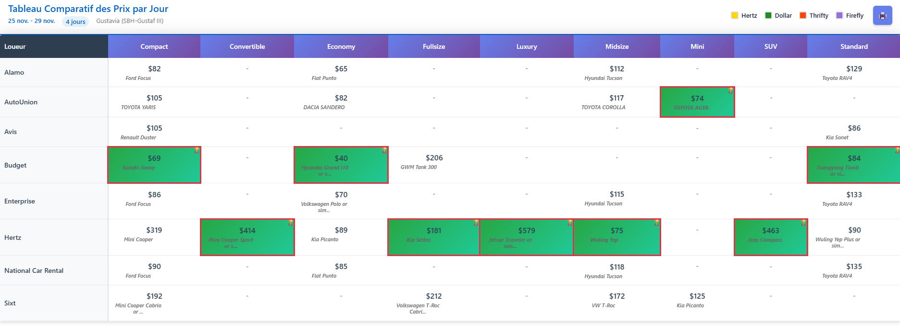

# 🚗 Expedia Car Comparator

Extension Chrome qui transforme les résultats de recherche de véhicules Expedia en tableau comparatif interactif.

## ✨ Fonctionnalités

### 📊 **Tableau comparatif simplifié**
- **Prix par jour** organisés par loueur et catégorie
- **Meilleurs prix** automatiquement encadrés en rouge 🏆
- **Modèles de véhicules** affichés sous chaque prix
- **Dates et durée** de location extraites automatiquement

### 🎨 **Filtres interactifs par loueur**
- **Hertz** 🟨 (Jaune doré)
- **Dollar** 🟢 (Vert forêt)  
- **Thrifty** 🟠 (Orange rouge)
- **Firefly** 🟣 (Violet)

### 🖨️ **Impression optimisée**
- Format paysage A4
- Suppression des modèles pour l'impression
- Conservation des couleurs des meilleurs prix
- Pas d'en-tête/pied de page navigateur

### ⚡ **Chargement intelligent**
- Défilement automatique de la page
- Clic automatique sur "Show more"
- Extraction robuste avec méthodes alternatives
- Temps d'attente optimisés

## 🚀 Installation

1. **Télécharger** ou cloner ce repository
2. **Ouvrir Chrome** → `chrome://extensions/`
3. **Activer** le mode développeur (toggle en haut à droite)
4. **Cliquer** sur "Charger l'extension non empaquetée"
5. **Sélectionner** le dossier de l'extension

## 📱 Utilisation

1. **Aller** sur une page de recherche de véhicules Expedia
2. **Attendre** que les résultats se chargent
3. **Cliquer** sur le bouton "🚗 Créer un tableau comparatif"
4. **Utiliser** les filtres pour comparer les loueurs
5. **Imprimer** avec le bouton 🖨️

## 🌐 Compatibilité

- ✅ expedia.com
- ✅ expedia.fr  
- ✅ expedia.ca
- ✅ Chrome 88+
- ✅ Edge 88+

## 🛠️ Technologies

- **JavaScript ES6+** pour la logique métier
- **CSS3** avec Flexbox et Grid
- **Chrome Extension API v3**
- **DOM Manipulation** avancée
- **Print CSS** optimisé

## 📸 Captures d'écran



## 🔧 Développement

### Structure du projet
```
├── manifest.json      # Configuration de l'extension
├── content.js         # Script principal d'injection
├── styles.css         # Styles du tableau
├── popup.html         # Interface de la popup
└── popup.js          # Logique de la popup
```

### Fonctionnalités techniques
- **Extraction intelligente** avec sélecteurs CSS multiples
- **Gestion d'erreur robuste** avec méthodes alternatives
- **Optimisation des performances** avec debouncing
- **Responsive design** pour différentes résolutions

## 🤝 Contribution

Les contributions sont les bienvenues ! N'hésitez pas à :
- 🐛 Signaler des bugs
- 💡 Proposer des améliorations
- 🔧 Soumettre des pull requests

## 📄 Licence

MIT License - voir [LICENSE](LICENSE) pour plus de détails.

## 👨‍💻 Auteur

**Sébastien** ([@caloops971](https://github.com/caloops971))
- 📧 sebastien@caloops.com

---

⭐ **N'hésitez pas à donner une étoile si cette extension vous est utile !**